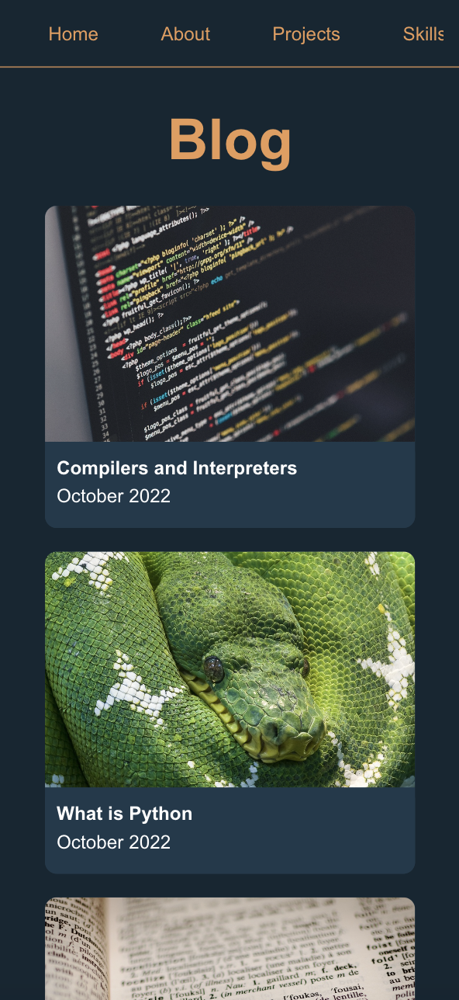

# T1A2 Portfolio - Matt Garrow

This is my portfolio website.

Mobile view

I deviated from my wireframes quite a lot, but they were very helpful in laying out the design.

I struggled with the right way to do a menu, so I opted instead to a scrolling nav bar at the top that becomes a right-aligned menu at the desktop media breakpoint. This makes it easier for people to quickly go to a page, instead of having to click a burger menu and then the page.

Colour choices are in line with accessability guidelines for appropriate contrast levels and viewing.

Wireframe: [Figma link](https://www.figma.com/file/efpb32yzwvxEcuG2w1a3IM/Portfolio)

